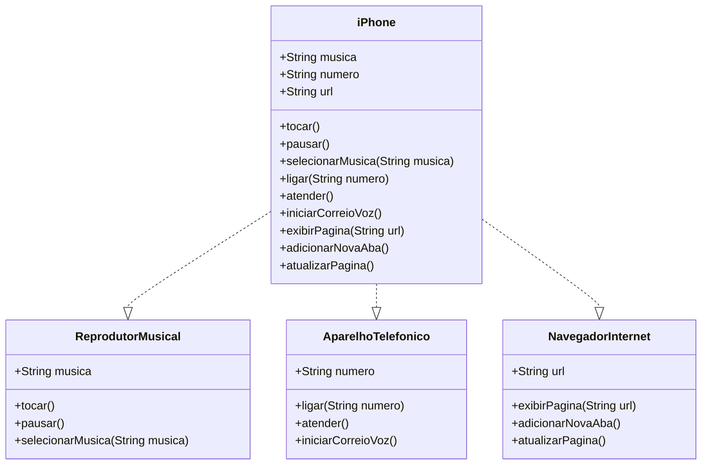

<h1 align="center">Modelando iPhone usando diagrama de classes</h1>

# 📌 Index

* [Index](https://github.com/mayaram4rtins/dio-uml-iphone/blob/main/README.md#pushpin-index)
* [Descrição](https://github.com/mayaram4rtins/dio-uml-iphone/blob/main/README.md#page_facing_up-descrição)
* [Desenvolvimento individual](https://github.com/mayaram4rtins/dio-uml-iphone/blob/main/README.md#wrench-desenvolvimento-individual)
* [Ferramentas e linguagens](https://github.com/mayaram4rtins/dio-uml-iphone/blob/main/README.md#snake-ferramentas-e-linguagens)
* [Diagrama de classes do iPhone](https://github.com/mayaram4rtins/dio-uml-iphone/blob/main/README.md#chart-diagrama-de-classes)

# 📄 Descrição

Repositório para o projeto "Modelando Iphone com diagrama UML" do bootcamp Java Native Cloud na DIO

# 🔧 Desenvolvimento individual

- `Skill 1`: Utilização do diagrama de classes
- `Skill 2`: Uso da linguagem mermaid.

# 🐍 Ferramentas e linguagens

+ Mermaid
+ https://mermaid.live

# 💹 Diagrama de classes

Seguindo a trilha pelo (link)[https://github.com/digitalinnovationone/trilha-java-basico/tree/main/desafios/poo], idealizei um diagrama de classes do iPhone em seu lançamento com algumas features iniciais como:

- Reprodutor Musical (Métodos: tocar(), pausar(), selecionarMusica(String musica))
- Aparelho Telefônico (Métodos: ligar(String numero), atender(), iniciarCorreioVoz())
- Navegador na Internet (Métodos: exibirPagina(String url), adicionarNovaAba(), atualizarPagina())

